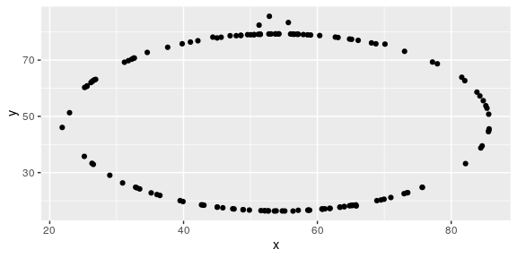

Lab 01 - Hello R
================
John Adams
3/11/2021

## Load packages and data

``` r
library(tidyverse) 
library(datasauRus)
```

## Exercises

### Exercise 1

``` r
glimpse(datasaurus_dozen)
```

    ## Rows: 1,846
    ## Columns: 3
    ## $ dataset <chr> "dino", "dino", "dino", "dino", "dino", "dino", "dino", "dino…
    ## $ x       <dbl> 55.3846, 51.5385, 46.1538, 42.8205, 40.7692, 38.7179, 35.6410…
    ## $ y       <dbl> 97.1795, 96.0256, 94.4872, 91.4103, 88.3333, 84.8718, 79.8718…

``` r
?datasauRus
```

``` r
datasaurus_dozen %>%
  count(dataset)
```

    ## # A tibble: 13 x 2
    ##    dataset        n
    ##    <chr>      <int>
    ##  1 away         142
    ##  2 bullseye     142
    ##  3 circle       142
    ##  4 dino         142
    ##  5 dots         142
    ##  6 h_lines      142
    ##  7 high_lines   142
    ##  8 slant_down   142
    ##  9 slant_up     142
    ## 10 star         142
    ## 11 v_lines      142
    ## 12 wide_lines   142
    ## 13 x_shape      142

### Exercise 2

The answers for this Exercise are given for you below. But you should
clean up some of the narrative so that it only includes what you want to
turn in.

First let’s plot the data in the dino dataset:

``` r
dino_data <- datasaurus_dozen %>%
  filter(dataset == "dino")
ggplot(data = dino_data, mapping = aes(x = x, y = y)) +
  geom_point()
```

<!-- -->

And next calculate the correlation between `x` and `y` in this dataset:

``` r
dino_data %>%
  summarize(r = cor(x, y))
```

    ## # A tibble: 1 x 1
    ##         r
    ##     <dbl>
    ## 1 -0.0645

### Exercise 3

Add code and narrative as needed. Note that the R chunks are labelled
with `plot-star` and `cor-star` to provide spaces to place the code for
plotting and calculating the correlation coefficient. To finish, clean
up the narrative by removing these instructions.

Blah blah blah…

``` r
star_data <- datasaurus_dozen %>%
  filter(dataset == "star")
  
star_data_viz <- datasaurus_dozen %>%
  filter(dataset == "star") %>%
ggplot(aes(x = x, y = y)) +
  geom_point()

star_data
```

    ## # A tibble: 142 x 3
    ##    dataset     x     y
    ##    <chr>   <dbl> <dbl>
    ##  1 star     58.2  91.9
    ##  2 star     58.2  92.2
    ##  3 star     58.7  90.3
    ##  4 star     57.3  89.9
    ##  5 star     58.1  92.0
    ##  6 star     57.5  88.1
    ##  7 star     28.1  63.5
    ##  8 star     28.1  63.6
    ##  9 star     28.1  63.1
    ## 10 star     27.6  62.8
    ## # … with 132 more rows

I’m some text, you should replace me with more meaningful text…

``` r
star_data %>%
  summarize(r = cor(x, y))
```

    ## # A tibble: 1 x 1
    ##         r
    ##     <dbl>
    ## 1 -0.0630

### Exercise 4

Add code and narrative as needed. Note that two R chunks are given but
they are not labeled. Use the convention from above to name them
appropriately.

``` r
circle_data <- datasaurus_dozen %>%
  filter(dataset == "circle")
  
circle_data_viz <- datasaurus_dozen %>%
  filter(dataset == "circle") %>%
ggplot(aes(x = x, y = y)) +
  geom_point()
circle_data_viz
```

<!-- -->

``` r
circle_data %>%
  summarize(r = cor(x, y))
```

    ## # A tibble: 1 x 1
    ##         r
    ##     <dbl>
    ## 1 -0.0683

### Exercise 5

Add code and narrative as needed.

``` r
datasaurus_dozen %>%
ggplot(aes(x = x, y = y, color = dataset)) +
  geom_point() +
  facet_wrap(~dataset, ncol = 3) +
  theme(legend.position = "none")
```

<!-- -->

``` r
datasaurus_dozen %>%
  group_by(dataset) %>%
  summarize(r = cor(x, y))
```

    ## `summarise()` ungrouping output (override with `.groups` argument)

    ## # A tibble: 13 x 2
    ##    dataset          r
    ##    <chr>        <dbl>
    ##  1 away       -0.0641
    ##  2 bullseye   -0.0686
    ##  3 circle     -0.0683
    ##  4 dino       -0.0645
    ##  5 dots       -0.0603
    ##  6 h_lines    -0.0617
    ##  7 high_lines -0.0685
    ##  8 slant_down -0.0690
    ##  9 slant_up   -0.0686
    ## 10 star       -0.0630
    ## 11 v_lines    -0.0694
    ## 12 wide_lines -0.0666
    ## 13 x_shape    -0.0656
