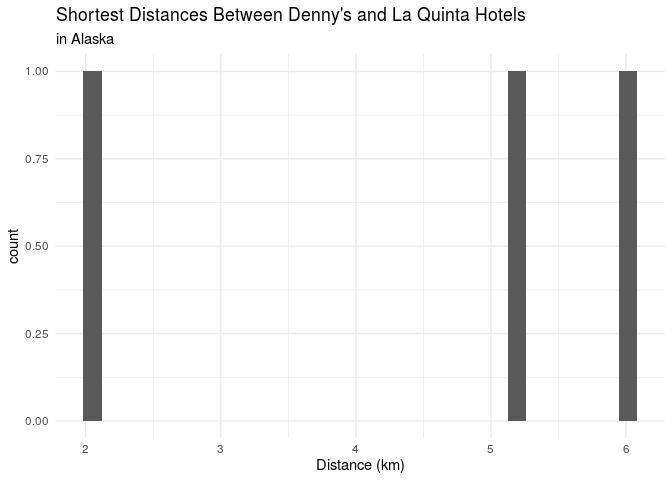
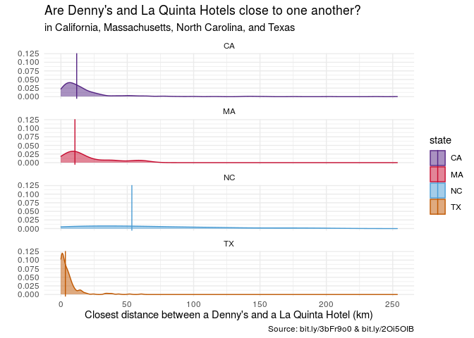

Lab 05 - La Quinta is Spanish for next to Denny’s, Pt. 2
================
John Adams
3/14/21

### Lab Directions

<https://rstudio-education.github.io/datascience-box/course-materials/lab-instructions/lab-05/lab-05-wrangle-sp-data.html>

### Load packages and data

``` r
library(tidyverse) 
library(dsbox) 
library(skimr)
```

``` r
states <- read_csv(url("https://raw.githubusercontent.com/rstudio-education/datascience-box/master/course-materials/starters/lab/lab-04-viz-sp-data/data/states.csv"))
```

### Exercise 1

``` r
dn_ak <- dennys %>%
  filter(state == "AK")

nrow(dn_ak)
```

    ## [1] 3

### Exercise 2

``` r
lq_ak <- laquinta %>%
  filter(state == "AK")

nrow(lq_ak)
```

    ## [1] 2

### Exercise 3

``` r
dn_lq_ak <- full_join(dn_ak, lq_ak, by = "state")
dn_lq_ak
```

    ## # A tibble: 6 x 11
    ##   address.x   city.x state zip.x longitude.x latitude.x address.y  city.y  zip.y
    ##   <chr>       <chr>  <chr> <chr>       <dbl>      <dbl> <chr>      <chr>   <chr>
    ## 1 2900 Denali Ancho… AK    99503       -150.       61.2 3501 Minn… "\nAnc… 99503
    ## 2 2900 Denali Ancho… AK    99503       -150.       61.2 4920 Dale… "\nFai… 99709
    ## 3 3850 Debar… Ancho… AK    99508       -150.       61.2 3501 Minn… "\nAnc… 99503
    ## 4 3850 Debar… Ancho… AK    99508       -150.       61.2 4920 Dale… "\nFai… 99709
    ## 5 1929 Airpo… Fairb… AK    99701       -148.       64.8 3501 Minn… "\nAnc… 99503
    ## 6 1929 Airpo… Fairb… AK    99701       -148.       64.8 4920 Dale… "\nFai… 99709
    ## # … with 2 more variables: longitude.y <dbl>, latitude.y <dbl>

### Exercise 4

``` r
glimpse(dn_lq_ak)
```

    ## Rows: 6
    ## Columns: 11
    ## $ address.x   <chr> "2900 Denali", "2900 Denali", "3850 Debarr Road", "3850 De…
    ## $ city.x      <chr> "Anchorage", "Anchorage", "Anchorage", "Anchorage", "Fairb…
    ## $ state       <chr> "AK", "AK", "AK", "AK", "AK", "AK"
    ## $ zip.x       <chr> "99503", "99503", "99508", "99508", "99701", "99701"
    ## $ longitude.x <dbl> -149.8767, -149.8767, -149.8090, -149.8090, -147.7600, -14…
    ## $ latitude.x  <dbl> 61.1953, 61.1953, 61.2097, 61.2097, 64.8366, 64.8366
    ## $ address.y   <chr> "3501 Minnesota Dr.", "4920 Dale Rd", "3501 Minnesota Dr."…
    ## $ city.y      <chr> "\nAnchorage", "\nFairbanks", "\nAnchorage", "\nFairbanks"…
    ## $ zip.y       <chr> "99503", "99709", "99503", "99709", "99503", "99709"
    ## $ longitude.y <dbl> -149.9119, -147.8660, -149.9119, -147.8660, -149.9119, -14…
    ## $ latitude.y  <dbl> 61.18843, 64.82426, 61.18843, 64.82426, 61.18843, 64.82426

``` r
nrow(dn_lq_ak)
```

    ## [1] 6

### Exercise 5

``` r
haversine <- function(long1, lat1, long2, lat2, round = 3) {
  # convert to radians
  long1 = long1 * pi / 180
  lat1  = lat1  * pi / 180
  long2 = long2 * pi / 180
  lat2  = lat2  * pi / 180
  
  R = 6371 # Earth mean radius in km
  
  a = sin((lat2 - lat1)/2)^2 + cos(lat1) * cos(lat2) * sin((long2 - long1)/2)^2
  d = R * 2 * asin(sqrt(a))
  
  return( round(d,round) ) # distance in km
}
```

### Exercise 6

``` r
dn_lq_ak <- dn_lq_ak %>%
  mutate(distance = haversine(longitude.x, latitude.x, longitude.y, latitude.y, round = 3))
```

### Exercise 7

``` r
dn_lq_ak_mindist <- dn_lq_ak %>%
  group_by(address.x) %>%
  summarise(closest = min(distance)) %>%
  arrange(-desc(closest))
```

### Exercise 8

``` r
dn_lq_ak_mindist %>%
  ggplot(aes(x = closest)) +
  geom_histogram() +
  labs(title = "Shortest Distances Between Denny's and La Quinta Hotels",
       subtitle = "in Alaska",
       x = "Distance (km)") +
  theme_minimal()
```

    ## `stat_bin()` using `bins = 30`. Pick better value with `binwidth`.

<!-- -->

``` r
dn_lq_ak_mindist %>%
  skim(closest)
```

|                                                  |            |
|:-------------------------------------------------|:-----------|
| Name                                             | Piped data |
| Number of rows                                   | 3          |
| Number of columns                                | 2          |
| \_\_\_\_\_\_\_\_\_\_\_\_\_\_\_\_\_\_\_\_\_\_\_   |            |
| Column type frequency:                           |            |
| numeric                                          | 1          |
| \_\_\_\_\_\_\_\_\_\_\_\_\_\_\_\_\_\_\_\_\_\_\_\_ |            |
| Group variables                                  | None       |

Data summary

**Variable type: numeric**

| skim\_variable | n\_missing | complete\_rate | mean |  sd |   p0 |  p25 | p50 | p75 | p100 | hist  |
|:---------------|-----------:|---------------:|-----:|----:|-----:|-----:|----:|----:|-----:|:------|
| closest        |          0 |              1 | 4.41 | 2.1 | 2.04 | 3.62 | 5.2 | 5.6 |    6 | ▇▁▁▇▇ |

### Exercise 9

filter each datat frame to just NC and then join.

``` r
dn_nc <- dennys %>%
  filter(state == "NC")

nrow(dn_nc)
```

    ## [1] 28

``` r
lq_nc <- laquinta %>%
  filter(state == "NC")

nrow(lq_nc)
```

    ## [1] 12

``` r
12*28 #prediction of rows
```

    ## [1] 336

``` r
dn_lq_nc <- full_join(dn_nc, lq_nc, by = "state")
dn_lq_nc
```

    ## # A tibble: 336 x 11
    ##    address.x  city.x  state zip.x longitude.x latitude.x address.y  city.y zip.y
    ##    <chr>      <chr>   <chr> <chr>       <dbl>      <dbl> <chr>      <chr>  <chr>
    ##  1 1 Regent … Ashevi… NC    28806       -82.6       35.6 165 Hwy 1… "\nBo… 28607
    ##  2 1 Regent … Ashevi… NC    28806       -82.6       35.6 3127 Sloa… "\nCh… 28208
    ##  3 1 Regent … Ashevi… NC    28806       -82.6       35.6 4900 Sout… "\nCh… 28217
    ##  4 1 Regent … Ashevi… NC    28806       -82.6       35.6 4414 Durh… "\nDu… 27707
    ##  5 1 Regent … Ashevi… NC    28806       -82.6       35.6 1910 West… "\nDu… 27713
    ##  6 1 Regent … Ashevi… NC    28806       -82.6       35.6 1201 Lana… "\nGr… 27407
    ##  7 1 Regent … Ashevi… NC    28806       -82.6       35.6 1607 Fair… "\nCo… 28613
    ##  8 1 Regent … Ashevi… NC    28806       -82.6       35.6 191 Cresc… "\nCa… 27518
    ##  9 1 Regent … Ashevi… NC    28806       -82.6       35.6 2211 Summ… "\nRa… 27612
    ## 10 1 Regent … Ashevi… NC    28806       -82.6       35.6 1001 Aeri… "\nMo… 27560
    ## # … with 326 more rows, and 2 more variables: longitude.y <dbl>,
    ## #   latitude.y <dbl>

``` r
dn_lq_nc <- dn_lq_nc %>%
   mutate(distance = haversine(longitude.x, latitude.x, longitude.y, latitude.y, round = 3))
```

``` r
dn_lq_nc_mindist <- dn_lq_nc %>%
  group_by(address.x) %>%
  summarise(closest = min(distance)) %>%
  arrange(-desc(closest))
```

``` r
nc_hist <- dn_lq_nc_mindist %>%
  ggplot(aes(x = closest)) +
  geom_histogram(binwidth = 10) +
  labs(title = "Shortest Distances Between Denny's and La Quinta Hotels",
       subtitle = "in North Carolina",
       x = "Distance (km)") +
  theme_minimal()

dn_lq_nc_mindist %>%
  skim(closest)
```

|                                                  |            |
|:-------------------------------------------------|:-----------|
| Name                                             | Piped data |
| Number of rows                                   | 28         |
| Number of columns                                | 2          |
| \_\_\_\_\_\_\_\_\_\_\_\_\_\_\_\_\_\_\_\_\_\_\_   |            |
| Column type frequency:                           |            |
| numeric                                          | 1          |
| \_\_\_\_\_\_\_\_\_\_\_\_\_\_\_\_\_\_\_\_\_\_\_\_ |            |
| Group variables                                  | None       |

Data summary

**Variable type: numeric**

| skim\_variable | n\_missing | complete\_rate |  mean |    sd |   p0 |   p25 |   p50 |   p75 |   p100 | hist  |
|:---------------|-----------:|---------------:|------:|------:|-----:|------:|------:|------:|-------:|:------|
| closest        |          0 |              1 | 65.44 | 53.42 | 1.78 | 22.39 | 53.46 | 93.99 | 187.94 | ▇▅▃▂▂ |

### Exercise 10

filter each data frame to just TX and then join.

``` r
dn_tx <- dennys %>%
  filter(state == "TX")

nrow(dn_tx)
```

    ## [1] 200

``` r
lq_tx <- laquinta %>%
  filter(state == "TX")

nrow(lq_tx)
```

    ## [1] 237

``` r
200*237 #prediction of rows
```

    ## [1] 47400

``` r
dn_lq_tx <- full_join(dn_tx, lq_tx, by = "state")
dn_lq_tx
```

    ## # A tibble: 47,400 x 11
    ##    address.x  city.x  state zip.x longitude.x latitude.x address.y  city.y zip.y
    ##    <chr>      <chr>   <chr> <chr>       <dbl>      <dbl> <chr>      <chr>  <chr>
    ##  1 120 East … Abilene TX    79601       -99.6       32.4 3018 CatC… "\nAb… 79606
    ##  2 120 East … Abilene TX    79601       -99.6       32.4 3501 West… "\nAb… 79601
    ##  3 120 East … Abilene TX    79601       -99.6       32.4 14925 Lan… "\nAd… 75254
    ##  4 120 East … Abilene TX    79601       -99.6       32.4 909 East … "\nAl… 78516
    ##  5 120 East … Abilene TX    79601       -99.6       32.4 2400 East… "\nAl… 78332
    ##  6 120 East … Abilene TX    79601       -99.6       32.4 1220 Nort… "\nAl… 75013
    ##  7 120 East … Abilene TX    79601       -99.6       32.4 1165 Hwy … "\nAl… 76009
    ##  8 120 East … Abilene TX    79601       -99.6       32.4 880 South… "\nAl… 77511
    ##  9 120 East … Abilene TX    79601       -99.6       32.4 1708 Inte… "\nAm… 79103
    ## 10 120 East … Abilene TX    79601       -99.6       32.4 9305 East… "\nAm… 79118
    ## # … with 47,390 more rows, and 2 more variables: longitude.y <dbl>,
    ## #   latitude.y <dbl>

``` r
dn_lq_tx <- dn_lq_tx %>%
   mutate(distance = haversine(longitude.x, latitude.x, longitude.y, latitude.y, round = 3))
```

``` r
dn_lq_tx_mindist <- dn_lq_tx %>%
  group_by(address.x) %>%
  summarise(closest = min(distance)) %>%
  arrange(-desc(closest))
```

``` r
tx_hist <- dn_lq_tx_mindist %>%
  ggplot(aes(x = closest)) +
  geom_histogram(binwidth = 10) +
  labs(title = "Shortest Distances Between Denny's and La Quinta Hotels",
       subtitle = "in Texas",
       x = "Distance (km)") +
  theme_minimal()

dn_lq_tx_mindist %>%
  skim(closest)
```

|                                                  |            |
|:-------------------------------------------------|:-----------|
| Name                                             | Piped data |
| Number of rows                                   | 200        |
| Number of columns                                | 2          |
| \_\_\_\_\_\_\_\_\_\_\_\_\_\_\_\_\_\_\_\_\_\_\_   |            |
| Column type frequency:                           |            |
| numeric                                          | 1          |
| \_\_\_\_\_\_\_\_\_\_\_\_\_\_\_\_\_\_\_\_\_\_\_\_ |            |
| Group variables                                  | None       |

Data summary

**Variable type: numeric**

| skim\_variable | n\_missing | complete\_rate | mean |   sd |   p0 |  p25 |  p50 |  p75 |  p100 | hist  |
|:---------------|-----------:|---------------:|-----:|-----:|-----:|-----:|-----:|-----:|------:|:------|
| closest        |          0 |              1 | 5.79 | 8.83 | 0.02 | 0.73 | 3.37 | 6.63 | 60.58 | ▇▁▁▁▁ |

### Exercise 11a

filter each data frame to just MA and then join.

``` r
dn_ma <- dennys %>%
  filter(state == "MA")

nrow(dn_ma)
```

    ## [1] 8

``` r
lq_ma <- laquinta %>%
  filter(state == "MA")

nrow(lq_ma)
```

    ## [1] 6

``` r
8*6 #prediction of rows
```

    ## [1] 48

``` r
dn_lq_ma <- full_join(dn_ma, lq_ma, by = "state")
dn_lq_ma
```

    ## # A tibble: 48 x 11
    ##    address.x  city.x  state zip.x longitude.x latitude.x address.y  city.y zip.y
    ##    <chr>      <chr>   <chr> <chr>       <dbl>      <dbl> <chr>      <chr>  <chr>
    ##  1 467 Memor… Chicop… MA    01020       -72.6       42.2 131 River… "\nAn… 01810
    ##  2 467 Memor… Chicop… MA    01020       -72.6       42.2 446 South… "\nAu… 01501
    ##  3 467 Memor… Chicop… MA    01020       -72.6       42.2 23 Cummin… "\nSo… 02145
    ##  4 467 Memor… Chicop… MA    01020       -72.6       42.2 24 Beaver… "\nMi… 01757
    ##  5 467 Memor… Chicop… MA    01020       -72.6       42.2 100 Congr… "\nSp… 01104
    ##  6 467 Memor… Chicop… MA    01020       -72.6       42.2 478 Main … "\nSt… 01518
    ##  7 152 Endic… Danvers MA    01923       -70.9       42.5 131 River… "\nAn… 01810
    ##  8 152 Endic… Danvers MA    01923       -70.9       42.5 446 South… "\nAu… 01501
    ##  9 152 Endic… Danvers MA    01923       -70.9       42.5 23 Cummin… "\nSo… 02145
    ## 10 152 Endic… Danvers MA    01923       -70.9       42.5 24 Beaver… "\nMi… 01757
    ## # … with 38 more rows, and 2 more variables: longitude.y <dbl>,
    ## #   latitude.y <dbl>

``` r
dn_lq_ma <- dn_lq_ma %>%
   mutate(distance = haversine(longitude.x, latitude.x, longitude.y, latitude.y, round = 3))
```

``` r
dn_lq_ma_mindist <- dn_lq_ma %>%
  group_by(address.x) %>%
  summarise(closest = min(distance)) %>%
  arrange(-desc(closest))
```

``` r
ma_hist <- dn_lq_ma_mindist %>%
  ggplot(aes(x = closest)) +
  geom_histogram(binwidth = 10) +
  labs(title = "Shortest Distances Between Denny's and La Quinta Hotels",
       subtitle = "in Massachusetts",
       x = "Distance (km)") +
  theme_minimal()

dn_lq_ma_mindist %>%
  skim(closest)
```

|                                                  |            |
|:-------------------------------------------------|:-----------|
| Name                                             | Piped data |
| Number of rows                                   | 8          |
| Number of columns                                | 2          |
| \_\_\_\_\_\_\_\_\_\_\_\_\_\_\_\_\_\_\_\_\_\_\_   |            |
| Column type frequency:                           |            |
| numeric                                          | 1          |
| \_\_\_\_\_\_\_\_\_\_\_\_\_\_\_\_\_\_\_\_\_\_\_\_ |            |
| Group variables                                  | None       |

Data summary

**Variable type: numeric**

| skim\_variable | n\_missing | complete\_rate |  mean |    sd |   p0 |  p25 |   p50 |  p75 |  p100 | hist  |
|:---------------|-----------:|---------------:|------:|------:|-----:|-----:|------:|-----:|------:|:------|
| closest        |          0 |              1 | 19.99 | 19.13 | 5.13 | 8.12 | 10.56 | 25.3 | 59.14 | ▇▂▁▂▂ |

### Exercise 11b

filter each data frame to just MA and then join.

``` r
dn_ca <- dennys %>%
  filter(state == "CA")

nrow(dn_ca)
```

    ## [1] 403

``` r
lq_ca <- laquinta %>%
  filter(state == "CA")

nrow(lq_ca)
```

    ## [1] 56

``` r
403*56 #prediction of rows
```

    ## [1] 22568

``` r
dn_lq_ca <- full_join(dn_ca, lq_ca, by = "state")
dn_lq_ca
```

    ## # A tibble: 22,568 x 11
    ##    address.x  city.x  state zip.x longitude.x latitude.x address.y  city.y zip.y
    ##    <chr>      <chr>   <chr> <chr>       <dbl>      <dbl> <chr>      <chr>  <chr>
    ##  1 14240 Us … Adelan… CA    92301       -117.       34.5 1752 Clem… "\nAn… 92802
    ##  2 14240 Us … Adelan… CA    92301       -117.       34.5 8858 Spec… "\nBa… 93308
    ##  3 14240 Us … Adelan… CA    92301       -117.       34.5 3232 Rive… "\nBa… 93308
    ##  4 14240 Us … Adelan… CA    92301       -117.       34.5 920 Unive… "\nBe… 94710
    ##  5 14240 Us … Adelan… CA    92301       -117.       34.5 3 Centerp… "\nLa… 90623
    ##  6 14240 Us … Adelan… CA    92301       -117.       34.5 1771 Rese… "\nDa… 95618
    ##  7 14240 Us … Adelan… CA    92301       -117.       34.5 6275 Dubl… "\nDu… 94568
    ##  8 14240 Us … Adelan… CA    92301       -117.       34.5 316 Pittm… "\nFa… 94534
    ##  9 14240 Us … Adelan… CA    92301       -117.       34.5 190 N. 10… "\nFo… 93625
    ## 10 14240 Us … Adelan… CA    92301       -117.       34.5 46200 Lan… "\nFr… 94538
    ## # … with 22,558 more rows, and 2 more variables: longitude.y <dbl>,
    ## #   latitude.y <dbl>

``` r
dn_lq_ca <- dn_lq_ca %>%
   mutate(distance = haversine(longitude.x, latitude.x, longitude.y, latitude.y, round = 3))
```

``` r
dn_lq_ca_mindist <- dn_lq_ca %>%
  group_by(address.x) %>%
  summarise(closest = min(distance)) %>%
  arrange(-desc(closest))
```

``` r
ca_hist <- dn_lq_ma_mindist %>%
  ggplot(aes(x = closest)) +
  geom_histogram(binwidth = 10) +
  labs(title = "Shortest Distances Between Denny's and La Quinta Hotels",
       subtitle = "in California",
       x = "Distance (km)") +
  theme_minimal()

dn_lq_ma_mindist %>%
  skim(closest)
```

|                                                  |            |
|:-------------------------------------------------|:-----------|
| Name                                             | Piped data |
| Number of rows                                   | 8          |
| Number of columns                                | 2          |
| \_\_\_\_\_\_\_\_\_\_\_\_\_\_\_\_\_\_\_\_\_\_\_   |            |
| Column type frequency:                           |            |
| numeric                                          | 1          |
| \_\_\_\_\_\_\_\_\_\_\_\_\_\_\_\_\_\_\_\_\_\_\_\_ |            |
| Group variables                                  | None       |

Data summary

**Variable type: numeric**

| skim\_variable | n\_missing | complete\_rate |  mean |    sd |   p0 |  p25 |   p50 |  p75 |  p100 | hist  |
|:---------------|-----------:|---------------:|------:|------:|-----:|-----:|------:|-----:|------:|:------|
| closest        |          0 |              1 | 19.99 | 19.13 | 5.13 | 8.12 | 10.56 | 25.3 | 59.14 | ▇▂▁▂▂ |

``` r
dn_lq_ma_mindist <- dn_lq_ma_mindist %>%
  mutate(state = "MA")
nrow(dn_lq_ma_mindist) 
```

    ## [1] 8

``` r
dn_lq_nc_mindist <- dn_lq_nc_mindist %>%
  mutate(state = "NC")
nrow(dn_lq_nc_mindist)
```

    ## [1] 28

``` r
dn_lq_tx_mindist <- dn_lq_tx_mindist %>%
  mutate(state = "TX")

dn_lq_ca_mindist <- dn_lq_ca_mindist %>%
mutate(state = "CA")


dn_lq_ma_nc_mindist <- full_join(dn_lq_ma_mindist, dn_lq_nc_mindist)
```

    ## Joining, by = c("address.x", "closest", "state")

``` r
dn_lq_ma_nc_tx_mindist <- full_join(dn_lq_ma_nc_mindist,dn_lq_tx_mindist)
```

    ## Joining, by = c("address.x", "closest", "state")

``` r
dn_lq_ma_nc_tx_ca_mindist <- full_join(dn_lq_ma_nc_tx_mindist, dn_lq_ca_mindist)
```

    ## Joining, by = c("address.x", "closest", "state")

``` r
dn_lq_ma_nc_tx_ca_mindist_group <- dn_lq_ma_nc_tx_ca_mindist %>%
  group_by(state) %>%
  summarise(med = median(closest))

dn_lq_ma_nc_tx_ca_mindist %>%
  ggplot(aes(x = closest, color = state, fill = state)) +
  geom_density(alpha = 0.5) +
  geom_vline(data = dn_lq_ma_nc_tx_ca_mindist_group, aes(xintercept = med, color = state)) +
  labs(
    title = "Are Denny's and La Quinta Hotels close to one another?",
    subtitle = "in California, Massachusetts, North Carolina, and Texas",
    x = "Closest distance between a Denny's and a La Quinta Hotel (km)",
    y = "",
    caption = "Source: bit.ly/3bFr9o0 & bit.ly/2Oi5OIB"
  ) +
  scale_color_manual(values = c(
    "MA" = "#c60c30",
    "TX" = "#BF5700",
    "NC" = "#4B9CD3",
    "CA" = "#552583"
  )) +
  scale_fill_manual(values = c(
    "MA" = "#c60c30",
    "TX" = "#BF5700",
    "NC" = "#4B9CD3",
    "CA" = "#552583"
  )) +
  theme_minimal() +
  facet_wrap(~state, nrow = 4, ncol = 1)
```

<!-- -->

``` r
dn_lq_ma_nc_tx_ca_mindist %>%
  group_by(state) %>%
  skim(closest)
```

|                                                  |            |
|:-------------------------------------------------|:-----------|
| Name                                             | Piped data |
| Number of rows                                   | 639        |
| Number of columns                                | 3          |
| \_\_\_\_\_\_\_\_\_\_\_\_\_\_\_\_\_\_\_\_\_\_\_   |            |
| Column type frequency:                           |            |
| numeric                                          | 1          |
| \_\_\_\_\_\_\_\_\_\_\_\_\_\_\_\_\_\_\_\_\_\_\_\_ |            |
| Group variables                                  | state      |

Data summary

**Variable type: numeric**

| skim\_variable | state | n\_missing | complete\_rate |  mean |    sd |   p0 |   p25 |   p50 |   p75 |   p100 | hist  |
|:---------------|:------|-----------:|---------------:|------:|------:|-----:|------:|------:|------:|-------:|:------|
| closest        | CA    |          0 |              1 | 22.08 | 33.05 | 0.02 |  5.77 | 11.90 | 22.80 | 253.46 | ▇▁▁▁▁ |
| closest        | MA    |          0 |              1 | 19.99 | 19.13 | 5.13 |  8.12 | 10.56 | 25.30 |  59.14 | ▇▂▁▂▂ |
| closest        | NC    |          0 |              1 | 65.44 | 53.42 | 1.78 | 22.39 | 53.46 | 93.99 | 187.94 | ▇▅▃▂▂ |
| closest        | TX    |          0 |              1 |  5.79 |  8.83 | 0.02 |  0.73 |  3.37 |  6.63 |  60.58 | ▇▁▁▁▁ |

Mitch Hedberg’s joke, “La Quinta is Spanish for”next to Denny’s", most
likely holds true in Texas compared to North Carolina and Massachusetts.
75 percent of La Quinta hotels are within 6.63 km of one another and on
average are about 3.37km apart.
