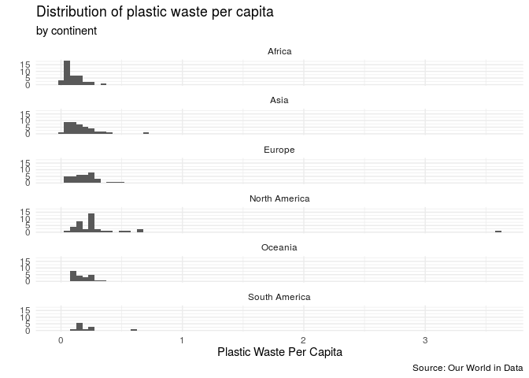
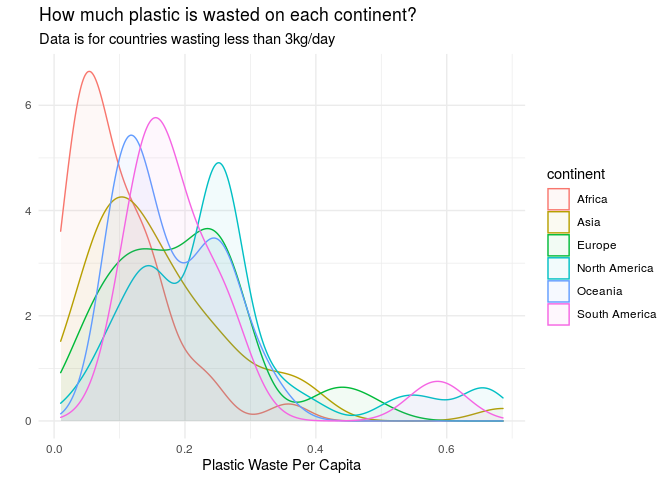
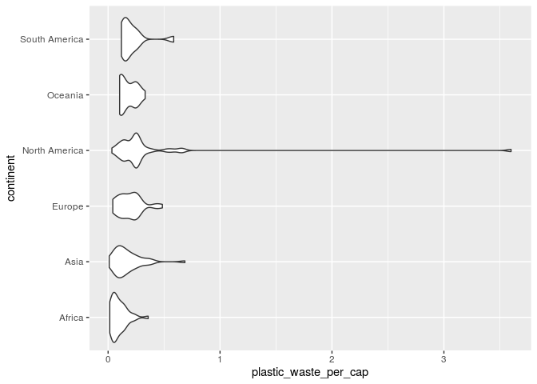
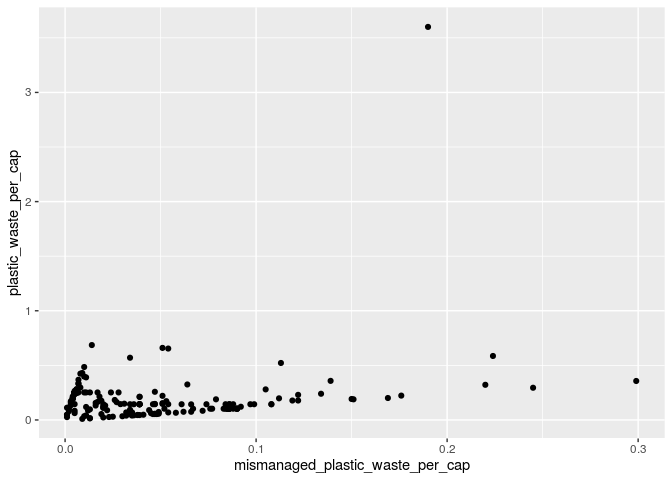
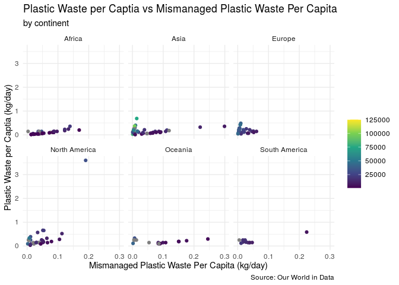
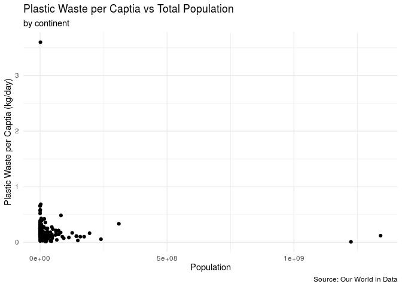
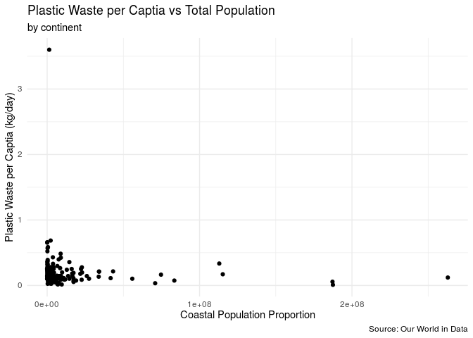
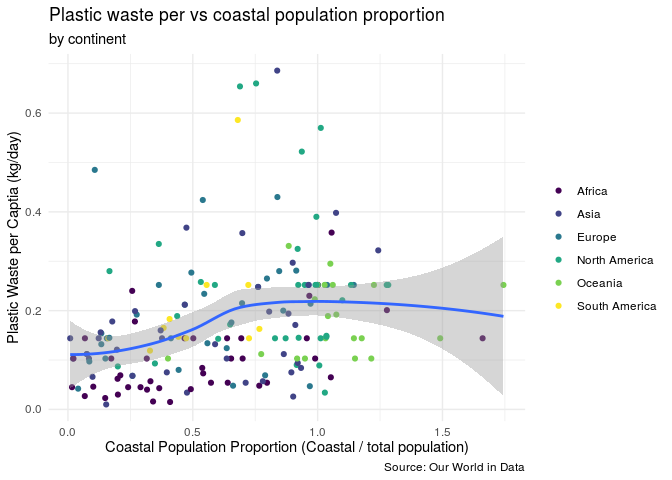

Lab 02 - Plastic waste
================
John Adams
3/12/21

## Lab Details

<https://rstudio-education.github.io/datascience-box/course-materials/lab-instructions/lab-02/lab-02-plastic-waste.html>

## Load packages and data

``` r
library(tidyverse) 
```

``` r
plastic_waste <- read_csv(url("https://raw.githubusercontent.com/rstudio-education/datascience-box/master/course-materials/starters/lab/lab-02-plastic-waste/data/plastic-waste.csv"))
```

## Exercises

### Exercise 1

Remove this text, and add your answer for Exercise 1 here.

``` r
plastic_waste %>%
  ggplot(aes(x = plastic_waste_per_cap)) +
  geom_histogram(binwidth = 0.05) +
  theme_minimal() +
  labs(title = "Distribution of plastic waste per capita",
       subtitle = "by continent",
       x = "Plastic Waste Per Capita", 
       y = "",
       caption = "Source: Our World in Data") +
  facet_wrap(~continent, nrow = 7)
```

    ## Warning: Removed 51 rows containing non-finite values (stat_bin).

<!-- -->

### Exercise 2

``` r
plastic_waste %>%
  filter(plastic_waste_per_cap < 3) %>%
  ggplot(aes(x = plastic_waste_per_cap,
             color = continent,
             fill = continent)) +
  geom_density(alpha = 0.05) +
  theme_minimal() +
  labs(title = "How much plastic is wasted on each continent?", x = "Plastic Waste Per Capita", y = "",
       subtitle = "Data is for countries wasting less than 3kg/day")
```

<!-- -->

### Exercise 3

Color and fill are applied to the mapping aesthetics so that the
continent data applies to all aspects of visualization. The alpha level
is reserved just for the density curve.

### Exercise 4

The violin plot captures the shape of the distribution better than a bx
plot.

``` r
plastic_waste %>%
  ggplot(aes(y = continent, x = plastic_waste_per_cap)) +
  geom_violin()
```

    ## Warning: Removed 51 rows containing non-finite values (stat_ydensity).

<!-- -->

### Exercise 5

Remove this text, and add your answer for Exercise 5 here.

``` r
plastic_waste %>%
  ggplot(aes(x = mismanaged_plastic_waste_per_cap, y = plastic_waste_per_cap)) +
  geom_point()
```

    ## Warning: Removed 51 rows containing missing values (geom_point).

<!-- -->

### Exercise 6

Remove this text, and add your answer for Exercise 6 here.

``` r
plastic_waste %>%
  ggplot(aes(x = mismanaged_plastic_waste_per_cap, y = plastic_waste_per_cap, color = gdp_per_cap)) +
  geom_point() +
  labs(title = "Plastic Waste per Captia vs Mismanaged Plastic Waste Per Capita",
       x = "Mismanaged Plastic Waste Per Capita (kg/day)",
       y = "Plastic Waste per Captia (kg/day)", 
       color = "", 
       subtitle = "by continent",
       caption = "Source: Our World in Data") +
  theme_minimal() +
  scale_color_viridis_c() +
  facet_wrap(~continent, nrow = 3, ncol = 3)
```

    ## Warning: Removed 51 rows containing missing values (geom_point).

<!-- -->
The visualization shows that there is a subset of countries that tend to
waste plastic at higher rates but mismanage that plastic waste at lower
rates. Countries in this subset largely come from Asia and Europe, while
a few also come from North America. However, there are also countries
from these continents along with ones in the remaining that use have
lower rates of plastic rates but do not manage that plastic waste well.
I would be interested in examing Asia, Europe, and North America even
further because it appears as though there are two distinct linear
patters in each, which signals to me there is most likely another
variable contributing to thse patterns.

After coloring the countries by GDP per capita, it appears as though
that factor is in part causing the variation described above.

### Exercise 7

Remove this text, and add your answer for Exercise 7 here.

``` r
plastic_waste %>%
  ggplot(aes(x = total_pop, y = plastic_waste_per_cap)) +
  geom_point() +
  labs(title = "Plastic Waste per Captia vs Total Population",
       x = "Population",
       y = "Plastic Waste per Captia (kg/day)", 
       color = "", 
       subtitle = "by continent",
       caption = "Source: Our World in Data") +
  theme_minimal()
```

    ## Warning: Removed 61 rows containing missing values (geom_point).

<!-- -->

``` r
plastic_waste %>%
  ggplot(aes(x = coastal_pop, y = plastic_waste_per_cap)) +
  geom_point() +
  labs(title = "Plastic Waste per Captia vs Total Population",
       x = "Coastal Population Proportion",
       y = "Plastic Waste per Captia (kg/day)", 
       color = "", 
       subtitle = "by continent",
       caption = "Source: Our World in Data") +
  theme_minimal()
```

    ## Warning: Removed 51 rows containing missing values (geom_point).

<!-- -->

### Exercise 8

Remove this text, and add your answer for Exercise 8 here.

``` r
plastic_waste %>%
  filter(plastic_waste_per_cap <= 3) %>%
  mutate(coastal_pop_p = coastal_pop/total_pop) %>%
  ggplot(aes(x = coastal_pop_p, y = plastic_waste_per_cap)) +
  geom_point(aes(color = continent)) +
  geom_smooth() +
  labs(title = "Plastic waste per vs coastal population proportion",
       x = "Coastal Population Proportion (Coastal / total population)",
       y = "Plastic Waste per Captia (kg/day)", 
       color = "", 
       subtitle = "by continent",
       caption = "Source: Our World in Data") +
  theme_minimal() +
  scale_color_viridis_d()
```

    ## `geom_smooth()` using method = 'loess' and formula 'y ~ x'

    ## Warning: Removed 10 rows containing non-finite values (stat_smooth).

    ## Warning: Removed 10 rows containing missing values (geom_point).

<!-- -->
