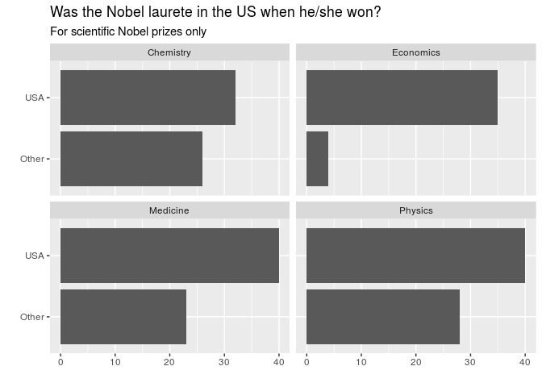
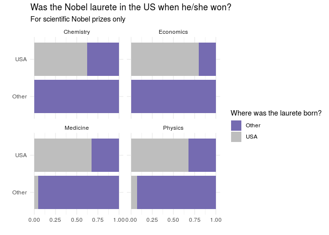

Lab 03 - Nobel Laureates
================
John Adams
3/12/21

## Lab directions

<https://rstudio-education.github.io/datascience-box/course-materials/lab-instructions/lab-03/lab-03-nobel-laureates.html>

### Load packages and data

``` r
library(tidyverse) 
```

``` r
nobel <- read_csv(url("https://raw.githubusercontent.com/rstudio-education/datascience-box/master/course-materials/starters/lab/lab-03-nobel-laureates/data/nobel.csv"))
```

## Exercises

### Exercise 1

``` r
glimpse(nobel)
```

    ## Rows: 935
    ## Columns: 26
    ## $ id                    <dbl> 1, 2, 3, 4, 5, 6, 6, 8, 9, 10, 11, 12, 13, 14, …
    ## $ firstname             <chr> "Wilhelm Conrad", "Hendrik A.", "Pieter", "Henr…
    ## $ surname               <chr> "Röntgen", "Lorentz", "Zeeman", "Becquerel", "C…
    ## $ year                  <dbl> 1901, 1902, 1902, 1903, 1903, 1903, 1911, 1904,…
    ## $ category              <chr> "Physics", "Physics", "Physics", "Physics", "Ph…
    ## $ affiliation           <chr> "Munich University", "Leiden University", "Amst…
    ## $ city                  <chr> "Munich", "Leiden", "Amsterdam", "Paris", "Pari…
    ## $ country               <chr> "Germany", "Netherlands", "Netherlands", "Franc…
    ## $ born_date             <date> 1845-03-27, 1853-07-18, 1865-05-25, 1852-12-15…
    ## $ died_date             <date> 1923-02-10, 1928-02-04, 1943-10-09, 1908-08-25…
    ## $ gender                <chr> "male", "male", "male", "male", "male", "female…
    ## $ born_city             <chr> "Remscheid", "Arnhem", "Zonnemaire", "Paris", "…
    ## $ born_country          <chr> "Germany", "Netherlands", "Netherlands", "Franc…
    ## $ born_country_code     <chr> "DE", "NL", "NL", "FR", "FR", "PL", "PL", "GB",…
    ## $ died_city             <chr> "Munich", NA, "Amsterdam", NA, "Paris", "Sallan…
    ## $ died_country          <chr> "Germany", "Netherlands", "Netherlands", "Franc…
    ## $ died_country_code     <chr> "DE", "NL", "NL", "FR", "FR", "FR", "FR", "GB",…
    ## $ overall_motivation    <chr> NA, NA, NA, NA, NA, NA, NA, NA, NA, NA, NA, NA,…
    ## $ share                 <dbl> 1, 2, 2, 2, 4, 4, 1, 1, 1, 1, 1, 1, 2, 2, 1, 1,…
    ## $ motivation            <chr> "\"in recognition of the extraordinary services…
    ## $ born_country_original <chr> "Prussia (now Germany)", "the Netherlands", "th…
    ## $ born_city_original    <chr> "Lennep (now Remscheid)", "Arnhem", "Zonnemaire…
    ## $ died_country_original <chr> "Germany", "the Netherlands", "the Netherlands"…
    ## $ died_city_original    <chr> "Munich", NA, "Amsterdam", NA, "Paris", "Sallan…
    ## $ city_original         <chr> "Munich", "Leiden", "Amsterdam", "Paris", "Pari…
    ## $ country_original      <chr> "Germany", "the Netherlands", "the Netherlands"…

There are 935 nobel laureates and 26 variables.

### Exercise 2

``` r
nobel_living <- nobel %>%
                filter(
                  !is.na(country),
                  gender != "org",
                  is.na(died_date)
                )
glimpse(nobel_living)
```

    ## Rows: 228
    ## Columns: 26
    ## $ id                    <dbl> 68, 69, 95, 97, 98, 99, 101, 103, 106, 107, 111…
    ## $ firstname             <chr> "Chen Ning", "Tsung-Dao", "Leon N.", "Leo", "Iv…
    ## $ surname               <chr> "Yang", "Lee", "Cooper", "Esaki", "Giaever", "J…
    ## $ year                  <dbl> 1957, 1957, 1972, 1973, 1973, 1973, 1974, 1975,…
    ## $ category              <chr> "Physics", "Physics", "Physics", "Physics", "Ph…
    ## $ affiliation           <chr> "Institute for Advanced Study", "Columbia Unive…
    ## $ city                  <chr> "Princeton NJ", "New York NY", "Providence RI",…
    ## $ country               <chr> "USA", "USA", "USA", "USA", "USA", "United King…
    ## $ born_date             <date> 1922-09-22, 1926-11-24, 1930-02-28, 1925-03-12…
    ## $ died_date             <date> NA, NA, NA, NA, NA, NA, NA, NA, NA, NA, NA, NA…
    ## $ gender                <chr> "male", "male", "male", "male", "male", "male",…
    ## $ born_city             <chr> "Hofei Anhwei", "Shanghai", "New York NY", "Osa…
    ## $ born_country          <chr> "China", "China", "USA", "Japan", "Norway", "Un…
    ## $ born_country_code     <chr> "CN", "CN", "US", "JP", "NO", "GB", "GB", "US",…
    ## $ died_city             <chr> NA, NA, NA, NA, NA, NA, NA, NA, NA, NA, NA, NA,…
    ## $ died_country          <chr> NA, NA, NA, NA, NA, NA, NA, NA, NA, NA, NA, NA,…
    ## $ died_country_code     <chr> NA, NA, NA, NA, NA, NA, NA, NA, NA, NA, NA, NA,…
    ## $ overall_motivation    <chr> NA, NA, NA, NA, NA, NA, NA, NA, NA, NA, NA, NA,…
    ## $ share                 <dbl> 2, 2, 3, 4, 4, 2, 2, 3, 2, 3, 4, 4, 3, 3, 2, 1,…
    ## $ motivation            <chr> "\"for their penetrating investigation of the s…
    ## $ born_country_original <chr> "China", "China", "USA", "Japan", "Norway", "Un…
    ## $ born_city_original    <chr> "Hofei Anhwei", "Shanghai", "New York NY", "Osa…
    ## $ died_country_original <chr> NA, NA, NA, NA, NA, NA, NA, NA, NA, NA, NA, NA,…
    ## $ died_city_original    <chr> NA, NA, NA, NA, NA, NA, NA, NA, NA, NA, NA, NA,…
    ## $ city_original         <chr> "Princeton NJ", "New York NY", "Providence RI",…
    ## $ country_original      <chr> "USA", "USA", "USA", "USA", "USA", "United King…

### Exercise 3

``` r
nobel_living <- nobel_living %>%
    mutate(
    country_us = if_else(country == "USA", "USA", "Other")
  )

nobel_living_science <- nobel_living %>%
  filter(category %in% c("Physics", "Medicine", "Chemistry", "Economics"))
```

``` r
nobel_living_science %>%
  ggplot(aes(x = country_us)) +
  geom_bar() +
  coord_flip() +
  labs(title = "Was the Nobel laurete in the US when he/she won?",
       subtitle = "For scientific Nobel prizes only",
       x = "",
       y = "") +
  facet_wrap(~category, nrow = 2)
```

<!-- -->

### Exercise 4

``` r
nobel_living_science <- nobel_living_science %>%
  mutate(
    born_country_us = if_else(born_country == "USA", "USA", "Other")
  )
```

### Exercise 5

``` r
nobel_living_science %>%
  ggplot(aes(x = country_us, fill = born_country_us)) +
  geom_bar(position = "fill") +
  coord_flip() +
  labs(title = "Was the Nobel laurete in the US when he/she won?",
       subtitle = "For scientific Nobel prizes only",
       x = "",
       y = "",
       fill = "Where was the laurete born?") +
  theme_minimal() +
 scale_fill_manual(values = c(
    "Other" = "#756bb1",
    "USA" = "gray"
  ))  +
  facet_wrap(~category, nrow = 2)
```

<!-- -->

``` r
nobel_living_science %>%
  group_by(category, country_us) %>%
  count(born_country_us) %>% 
  mutate(proportion = n / sum(n)) %>% 
  select(-n) %>%
  pivot_wider(names_from = born_country_us, values_from = proportion) 
```

    ## # A tibble: 8 x 4
    ## # Groups:   category, country_us [8]
    ##   category  country_us Other     USA
    ##   <chr>     <chr>      <dbl>   <dbl>
    ## 1 Chemistry Other      1     NA     
    ## 2 Chemistry USA        0.375  0.625 
    ## 3 Economics Other      1     NA     
    ## 4 Economics USA        0.2    0.8   
    ## 5 Medicine  Other      0.957  0.0435
    ## 6 Medicine  USA        0.325  0.675 
    ## 7 Physics   Other      0.929  0.0714
    ## 8 Physics   USA        0.325  0.675

### Exercise 6

The visualization above supports the Buzzfeed claim. Between 20 and 37.5
percent of nobel winners located in the US when they won were born in
another country.  
What also becomes clear through this visualizations is that US born
winners are not winning while in another country.
