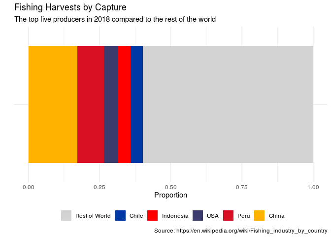

Lab 06 - Sad plots
================
John Adams
3/14/21

### Lab Directions

<https://rstudio-education.github.io/datascience-box/course-materials/lab-instructions/lab-06/lab-06-sad-plots.html>

### Load packages and data

``` r
library(tidyverse) 
library(dsbox) 
library(ggrepel)
```

``` r
staff <- read.csv(url("https://raw.githubusercontent.com/rstudio-education/datascience-box/master/course-materials/lab-instructions/lab-06/data/instructional-staff.csv"))

staff_long <- pivot_longer(staff, -faculty_type, names_to = "year") %>%
  mutate(value = as.numeric(value)) %>%
  separate(col = year, into = c("other_info", "year"), sep = "X") %>%
  select(-other_info) %>%
  mutate(year = as.numeric(year)) %>%
  group_by(faculty_type) %>%
  mutate(
    end_date     = if_else(year == max(year), TRUE, FALSE),
    end_label    = if_else(end_date, faculty_type, NULL)
  ) %>%
ungroup()
```

``` r
staff_long %>%
  ggplot(aes(x = year, y = value, group = faculty_type, color = faculty_type)) +
  geom_line()
```

<!-- -->

### Exercises 1-3

``` r
staff_long %>%
  ggplot(aes(x = year, 
             y = value, 
             group = faculty_type, 
             color = faculty_type, 
             label = end_label)) +
  geom_line(size = 0.7, alpha = 0.8) +
  geom_point(data = staff_long %>% filter(end_date)) +
  geom_label_repel(nudge_x = 10, 
             direction = "both",
             label.size = 0.01,
             segment.color = 'transparent'
             ) +
  labs(
    title = "Hiring Trends of Instructional Staff Employees Between 1975 and 2011",
    subtitle = "Percent of Part-Time Faculty Have Risen the Most", 
    x = "",
    y = "Percent of Hires",
    caption = "Source: https://bit.ly/3czejXJ"
  ) +
   theme(
    panel.grid = element_blank(),
    panel.background = element_rect(fill = NA),
    axis.ticks.x = element_line(size = 0.5),
    panel.border = element_blank()
   ) +
   guides(color = FALSE) +
  scale_x_continuous(limits = c(1975, 2030), breaks = seq(1975, 2011, 3)) +
  scale_color_manual(values = c(
    "Part-Time Faculty" = "#ef8a62",
    "Graduate Student Employees" = "gray",
    "Full-Time Tenured Faculty" = "gray",
    "Full-Time Non-Tenure-Track Faculty" = "gray",
    "Full-Time Tenure-Track Faculty" = "gray"))
```

<!-- -->

### Fisheries

Goals for improving area chart and 3D pie chart - segmented bar graphs
instead of 3D Pie - China and Indonesia seem to be the top two in each.
Will make those their own colors while all others will be gray. - Will
all other countries into one catgorery “Rest of World” - Makes sure
China and Indonesia at the bottom of the bars - create a frequency
variable

``` r
top_five_capture <- c("People's Republic of China", "Peru", "USA", "Indonesia", "Chile")

top_five_aquaculture <- c("People's Republic of China", "India", "Vietnam", "Indonesia", "Thailand")

fisheries_top <- fisheries %>%
  mutate(
    top_five_cap = if_else(country %in% top_five_capture, country, "Rest of World"),
    top_five_cap = case_when(
      top_five_cap == "People's Republic of China" ~ "China",
      TRUE  ~ top_five_cap),
    top_aqua = if_else(country %in% "People's Republic of China", country, "Rest of World"),
    top_aqua = case_when(
      top_aqua == "People's Republic of China" ~ "China",
      TRUE  ~ top_aqua
    )
  ) 
 
fisheries_capture_group <- fisheries_top %>%
  select(country, capture, top_five_cap) %>%
  group_by(top_five_cap) %>%
  summarise(
    total_capture = sum(capture)) %>%
  mutate(
    capture_prop = total_capture/sum(total_capture)
  ) %>%
  arrange(desc(capture_prop))

fisheries_aqua_group <- fisheries_top %>%
  select(country, aquaculture, top_aqua) %>%
  filter(!is.na(aquaculture)) %>%
  group_by(top_aqua) %>%
  summarise(
    total_aqua = sum(aquaculture)) %>%
  mutate(
    aqua_prop = total_aqua/sum(total_aqua)
  ) %>%
  arrange(desc(aqua_prop))
```

``` r
fisheries_capture_group %>%
  mutate(
    top_five_cap = fct_relevel(
      top_five_cap, 
      "Rest of World", "Chile", "Indonesia", "USA", "Peru", "China"),
    area = "area"
  ) %>%
  ggplot(aes(x = capture_prop, y = area, fill = top_five_cap)) +
  geom_col() +
    labs(
   title = "Fishing Harvests by Capture",
    subtitle = "The top five producers in 2018 compared to the rest of the world",
    x = "Proportion",
    y = "",
    caption = "Source: https://en.wikipedia.org/wiki/Fishing_industry_by_country",
   fill = NULL) +
  scale_fill_manual(values = c(
    "China" = "#FFB200",
    "Indonesia" = "#FF0000",
    "USA" = "#3C3B6E",
    "Chile" = "#0039A6",
    "Peru" = "#D91023",
    "Rest of World" = "light gray"
  )) +
  theme_minimal() +
 theme(legend.position = "bottom",
        axis.text.y =  element_blank(),
        axis.ticks.y = element_blank()) +
  guides(fill = guide_legend(nrow = 1))
```

<!-- -->

``` r
fisheries_aqua_group %>%
  mutate(
    top_aqua = fct_relevel(
      top_aqua, 
      "Rest of World", "China"),
    area = "area"
  ) %>%
  ggplot(aes(x = aqua_prop, y = area, fill = top_aqua)) +
  geom_col() +
    labs(
   title = "Fishing Harvests by Aquaculture",
    subtitle = "China dominates the 2018 aquaculture fishing harvist",
    x = "Proportion",
    y = "",
    caption = "Source: https://en.wikipedia.org/wiki/Fishing_industry_by_country",
   fill = NULL) +
  scale_fill_manual(values = c(
    "China" = "#FFB200",
    "Rest of World" = "light gray"
  )) +
  theme_minimal() +
  theme(legend.position = "bottom",
        axis.text.y =  element_blank(),
        axis.ticks.y = element_blank()) +
  guides(fill = guide_legend(nrow = 1))
```

<!-- -->
