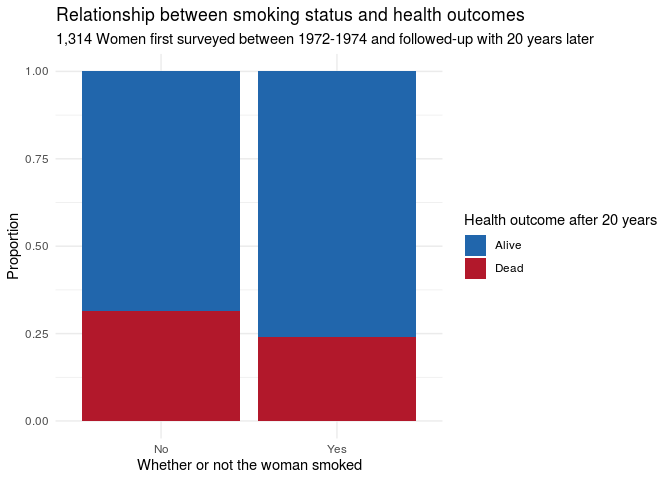
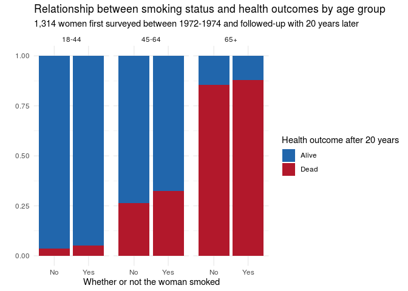

Lab 07 - Simpson’s paradox
================
John Adams
3/15/21

### Directions for Lab

<https://rstudio-education.github.io/datascience-box/course-materials/lab-instructions/lab-07/lab-07-simpsons-paradox.html>

### Load packages and data

``` r
library(tidyverse) 
library(mosaicData) 
```

### Exercise 1

``` r
?Whickham
```

Observational study.

### Exercise 2

``` r
head(Whickham)
```

    ##   outcome smoker age
    ## 1   Alive    Yes  23
    ## 2   Alive    Yes  18
    ## 3    Dead    Yes  71
    ## 4   Alive     No  67
    ## 5   Alive     No  64
    ## 6   Alive    Yes  38

``` r
nrow(Whickham)
```

    ## [1] 1314

``` r
glimpse(Whickham)
```

    ## Rows: 1,314
    ## Columns: 3
    ## $ outcome <fct> Alive, Alive, Dead, Alive, Alive, Alive, Alive, Dead, Alive, A…
    ## $ smoker  <fct> Yes, Yes, Yes, No, No, Yes, Yes, No, No, No, No, Yes, No, Yes,…
    ## $ age     <int> 23, 18, 71, 67, 64, 38, 45, 76, 28, 27, 28, 34, 20, 72, 48, 45…

1,314 people were included in this survey.

### Exercise 3

The researchers recorded 3 variables: age at time of first survey,
whether or not they were a smoker, and if the person was alive or dead
20 years after the first survey.

### Exercise 4

I’d expect poor health outcomes for those that smoke.

### Exercise 5

``` r
Whickham %>%
ggplot(aes(x = smoker, fill = outcome)) +
  geom_bar(position = "fill") +
  scale_fill_manual(values = c(
    "Alive" = "#2166ac",
    "Dead"  = "#b2182b"
  )) + 
  labs(title = "Relationship between smoking status and health outcomes",
       subtitle = "1,314 Women first surveyed between 1972-1974 and followed-up with 20 years later",
       x = "Whether or not the woman smoked", y = "Proportion", 
       fill = "Health outcome after 20 years") +
  theme_minimal()
```

<!-- -->

``` r
Whickham %>%
  count(smoker, outcome) %>% 
  group_by(smoker) %>%
  mutate(proportion = n / sum(n)) %>% 
  select(-n) %>%
  pivot_wider(names_from = smoker, values_from = proportion)
```

    ## # A tibble: 2 x 3
    ##   outcome    No   Yes
    ##   <fct>   <dbl> <dbl>
    ## 1 Alive   0.686 0.761
    ## 2 Dead    0.314 0.239

This visualization shows that those who did not smoke at the time of the
survey had a higher rate of death after 20 years.

``` r
Whickham_cat <- Whickham %>%
  mutate(
    age_cat = case_when(
      age <= 44 ~ "18-44",
      age > 44 & age <= 64 ~ "45-64",
      age > 64 ~ "65+"
    )
  )
```

``` r
Whickham_cat %>%
  ggplot(aes(x = smoker, fill = outcome)) +
  geom_bar(position = "fill") +
  facet_wrap(~age_cat, nrow = 1, ncol = 3) +
  theme_minimal() +
  scale_fill_manual(values = c(
    "Alive" = "#2166ac",
    "Dead"  = "#b2182b"
  )) + 
  labs(title = "Relationship between smoking status and health outcomes by age group",
       subtitle = "1,314 women first surveyed between 1972-1974 and followed-up with 20 years later",
       x = "Whether or not the woman smoked", y = "", 
       fill = "Health outcome after 20 years")
```

<!-- -->

``` r
Whickham_cat %>%
  count(smoker, age_cat, outcome) %>% 
  group_by(smoker, age_cat) %>%
  mutate(proportion = n / sum(n)) %>% 
  select(-n) %>%
  pivot_wider(names_from = age_cat, values_from = proportion)
```

    ## # A tibble: 4 x 5
    ## # Groups:   smoker [2]
    ##   smoker outcome `18-44` `45-64` `65+`
    ##   <fct>  <fct>     <dbl>   <dbl> <dbl>
    ## 1 No     Alive    0.965    0.735 0.145
    ## 2 No     Dead     0.0354   0.265 0.855
    ## 3 Yes    Alive    0.947    0.676 0.12 
    ## 4 Yes    Dead     0.0526   0.324 0.88

In contrast to our first visualization, these bar charts show that
within each age group, the rate of death is higher for those that
smoked. The oldest age group, 65+, has such high rates of death after 20
years, that they are causing the overal to paint an incorrect picture,
hense the simpsons paradox.
