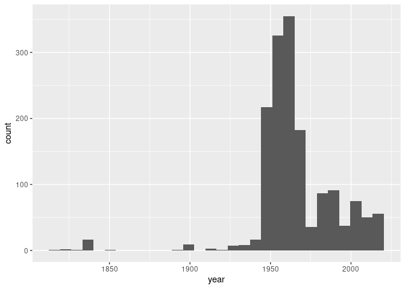

Lab 08 - University of Edinburgh Art Collection
================
John Adams
3/15/21

### Load packages and data

``` r
library(tidyverse) 
library(skimr)
library(rvest)
```

``` r
# Remove eval = FALSE or set it to TRUE once data is ready to be loaded
uoe_art <- read_csv("uoe-art.csv")
```

    ## 
    ## ── Column specification ────────────────────────────────────────────────────────
    ## cols(
    ##   title = col_character(),
    ##   artist = col_character(),
    ##   link = col_character()
    ## )

### Exercise 9

``` r
uoe_art <- uoe_art %>%
  separate(title, into = c("title", "date"), sep = "\\(") %>%
  mutate(year = str_remove(date, "\\)") %>% as.numeric()) %>%
  select(title, artist, year, date)
```

    ## Warning: Expected 2 pieces. Additional pieces discarded in 39 rows [163, 264,
    ## 491, 568, 597, 986, 1463, 1486, 1754, 1791, 1792, 1798, 1890, 1929, 1930, 1934,
    ## 1936, 1986, 2004, 2026, ...].

    ## Warning: Expected 2 pieces. Missing pieces filled with `NA` in 635 rows [1, 2,
    ## 3, 4, 5, 6, 7, 8, 9, 11, 12, 13, 14, 27, 28, 31, 33, 35, 36, 38, ...].

    ## Warning in str_remove(date, "\\)") %>% as.numeric(): NAs introduced by coercion

### Exercise 10

``` r
uoe_art %>%
  skim()
```

|                                                  |            |
|:-------------------------------------------------|:-----------|
| Name                                             | Piped data |
| Number of rows                                   | 2980       |
| Number of columns                                | 4          |
| \_\_\_\_\_\_\_\_\_\_\_\_\_\_\_\_\_\_\_\_\_\_\_   |            |
| Column type frequency:                           |            |
| character                                        | 3          |
| numeric                                          | 1          |
| \_\_\_\_\_\_\_\_\_\_\_\_\_\_\_\_\_\_\_\_\_\_\_\_ |            |
| Group variables                                  | None       |

Data summary

**Variable type: character**

| skim\_variable | n\_missing | complete\_rate | min | max | empty | n\_unique | whitespace |
|:---------------|-----------:|---------------:|----:|----:|------:|----------:|-----------:|
| title          |          1 |           1.00 |   0 |  95 |     8 |      1367 |          0 |
| artist         |        115 |           0.96 |   2 |  55 |     0 |      1111 |          0 |
| date           |        636 |           0.79 |   3 |  49 |     0 |       378 |          0 |

**Variable type: numeric**

| skim\_variable | n\_missing | complete\_rate |    mean |    sd |  p0 |  p25 |  p50 |  p75 | p100 | hist  |
|:---------------|-----------:|---------------:|--------:|------:|----:|-----:|-----:|-----:|-----:|:------|
| year           |       1402 |           0.53 | 1964.37 | 55.57 |   2 | 1953 | 1962 | 1979 | 2020 | ▁▁▁▁▇ |

### Exercises 11 & 12

``` r
uoe_art %>%
  ggplot(aes(x = year)) +
  geom_histogram()
```

    ## `stat_bin()` using `bins = 30`. Pick better value with `binwidth`.

    ## Warning: Removed 1402 rows containing non-finite values (stat_bin).

<!-- -->
The print titled Death Mask (2) is the one throwing things off because
when scrapped it captured th (2) as the year because it is in the same
format.

``` r
uoe_art <- uoe_art %>%
  mutate(
    year = case_when(
      year == 2 ~ 1964, 
      TRUE ~ year
    )
  )
```

``` r
uoe_art %>%
  ggplot(aes(x = year)) +
  geom_histogram()
```

    ## `stat_bin()` using `bins = 30`. Pick better value with `binwidth`.

    ## Warning: Removed 1402 rows containing non-finite values (stat_bin).

<!-- -->

### Exercise 13

``` r
uoe_art %>%
  count(artist) %>%
  arrange(desc(n))
```

    ## # A tibble: 1,112 x 2
    ##    artist               n
    ##    <chr>            <int>
    ##  1 Unknown            357
    ##  2 Emma Gillies       148
    ##  3 <NA>               115
    ##  4 John Bellany        22
    ##  5 Ann F Ward          19
    ##  6 Boris Bućan         17
    ##  7 Marjorie Wallace    17
    ##  8 Zygmunt Bukowski    17
    ##  9 Gordon Bryce        16
    ## 10 William Gillon      16
    ## # … with 1,102 more rows

Emma Gillies is a potter who grew up outside of Edinburgh and at one
point in her life studied pottery at Edinburgh College of Art.

### Exercise 14

``` r
child_titles <- uoe_art %>%
                filter(title %in% str_subset(title, "Child"))
child_titles
```

    ## # A tibble: 11 x 4
    ##    title                                 artist            year date            
    ##    <chr>                                 <chr>            <dbl> <chr>           
    ##  1 "The Sun Dissolves while Man Looks A… Eduardo Luigi P…    NA <NA>            
    ##  2 "Woman with Child and Still Life "    Catherine I. Mc…  1938 1938)           
    ##  3 "Child's collar. Chinese"             Unknown             NA <NA>            
    ##  4 "Figure Composition with Nurse and C… Edward A. Gage      NA Circa 1950)     
    ##  5 "Virgin and Child"                    Unknown             NA <NA>            
    ##  6 "Virgin and Child "                   Unknown             NA Tondo)          
    ##  7 "Untitled - Portrait of a Woman and … William Gillon      NA Feb 1962)       
    ##  8 "Virgin and Child "                   Unknown             NA statuette head …
    ##  9 "Untitled - Children Playing "        Monika L I Ueck…  1963 1963)           
    ## 10 "Child's chinese headdress"           Unknown             NA <NA>            
    ## 11 "The Children's Hour "                Eduardo Luigi P…    NA 1974-1976)
