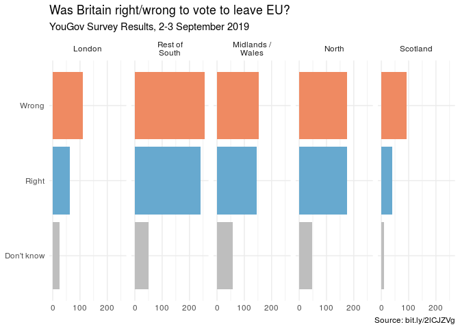
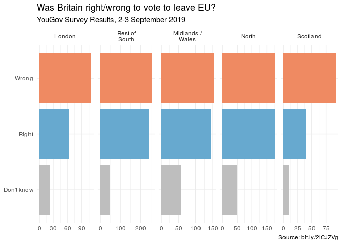
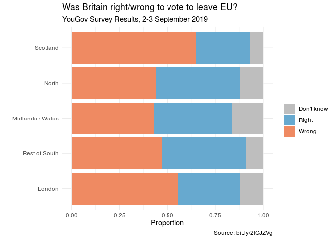

Brexit
================
Mine Çetinkaya-Rundel edited by John Adams

In September 2019, YouGov survey asked 1,639 GB adults the following
question:

> In hindsight, do you think Britain was right/wrong to vote to leave
> EU?
>
> -   Right to leave  
> -   Wrong to leave  
> -   Don’t know

The data from the survey are in `data/brexit.csv`.

``` r
brexit <- read_csv(url("https://raw.githubusercontent.com/rstudio-education/datascience-box/master/course-materials/application-exercises/ae-07-brexit-story-dataviz/data/brexit.csv"))
```

In the course video we made the following visualisation.

``` r
brexit <- brexit %>%
  mutate(
    region = fct_relevel(region, "london", "rest_of_south", "midlands_wales", "north", "scot"),
    region = fct_recode(region, London = "london", `Rest of South` = "rest_of_south", `Midlands / Wales` = "midlands_wales", North = "north", Scotland = "scot")
  )


ggplot(brexit, aes(y = opinion, fill = opinion)) +
  geom_bar() +
  facet_wrap(~region, nrow = 1, labeller = label_wrap_gen(width = 12)) +
  guides(fill = FALSE) +
  labs(
    title = "Was Britain right/wrong to vote to leave EU?",
    subtitle = "YouGov Survey Results, 2-3 September 2019",
    caption = "Source: bit.ly/2lCJZVg",
    x = NULL, y = NULL
  ) +
  scale_fill_manual(values = c(
    "Wrong" = "#ef8a62",
    "Right" = "#67a9cf",
    "Don't know" = "gray"
  )) +
  theme_minimal()
```

<!-- -->

In this application exercise we tell different stories with the same
data.

### Exercise 1 - Free scales

Add `scales = "free_x"` as an argument to the `facet_wrap()` function.
How does the visualisation change? How is the story this visualisation
telling different than the story the original plot tells?

``` r
ggplot(brexit, aes(y = opinion, fill = opinion)) +
  geom_bar() +
  facet_wrap(~region,
    nrow = 1, labeller = label_wrap_gen(width = 12),
    scales = "free_x"
  ) +
  guides(fill = FALSE) +
  labs(
    title = "Was Britain right/wrong to vote to leave EU?",
    subtitle = "YouGov Survey Results, 2-3 September 2019",
    caption = "Source: bit.ly/2lCJZVg",
    x = NULL, y = NULL
  ) +
  scale_fill_manual(values = c(
    "Wrong" = "#ef8a62",
    "Right" = "#67a9cf",
    "Don't know" = "gray"
  )) +
  theme_minimal()
```

<!-- -->

### Exercise 2 - Comparing proportions across facets

First, calculate the proportion of wrong, right, and don’t know answers
in each category and then plot these proportions (rather than the
counts) and then improve axis labeling. How is the story this
visualisation telling different than the story the original plot tells?
**Hint:** You’ll need the **scales** package to improve axis labeling,
which means you’ll need to load it on top of the document as well.

``` r
brexit %>%
  group_by(region) %>%
  count(opinion) %>%
  mutate(proportion = n/sum(n))
```

    ## # A tibble: 15 x 4
    ## # Groups:   region [5]
    ##    region           opinion        n proportion
    ##    <fct>            <chr>      <int>      <dbl>
    ##  1 London           Don't know    24     0.122 
    ##  2 London           Right         63     0.320 
    ##  3 London           Wrong        110     0.558 
    ##  4 Rest of South    Don't know    49     0.0896
    ##  5 Rest of South    Right        241     0.441 
    ##  6 Rest of South    Wrong        257     0.470 
    ##  7 Midlands / Wales Don't know    57     0.161 
    ##  8 Midlands / Wales Right        145     0.410 
    ##  9 Midlands / Wales Wrong        152     0.429 
    ## 10 North            Don't know    48     0.12  
    ## 11 North            Right        176     0.44  
    ## 12 North            Wrong        176     0.44  
    ## 13 Scotland         Don't know    10     0.0709
    ## 14 Scotland         Right         39     0.277 
    ## 15 Scotland         Wrong         92     0.652

### Exercise 3 - Comparing proportions across bars

Recreate the same visualisation from the previous exercise, this time
dodging the bars for opinion proportions for each region, rather than
faceting by region and then improve the legend. How is the story this
visualisation telling different than the story the previous plot tells?

``` r
brexit %>%
  ggplot(aes(y = region, fill = opinion)) +
  geom_bar(position = "fill") +
  labs(
   title = "Was Britain right/wrong to vote to leave EU?",
    subtitle = "YouGov Survey Results, 2-3 September 2019",
    x = "Proportion",
    y = "",
    caption = "Source: bit.ly/2lCJZVg",
   fill = NULL) +
  scale_fill_manual(values = c(
    "Wrong" = "#ef8a62",
    "Right" = "#67a9cf",
    "Don't know" = "gray"
  )) +
  theme_minimal()
```

<!-- -->
