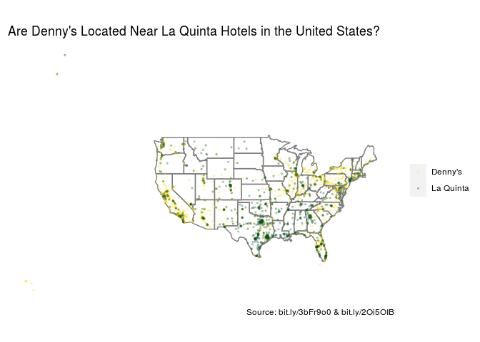
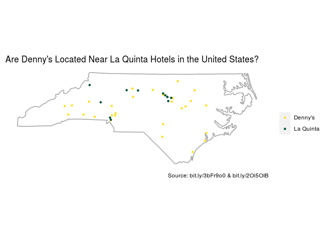
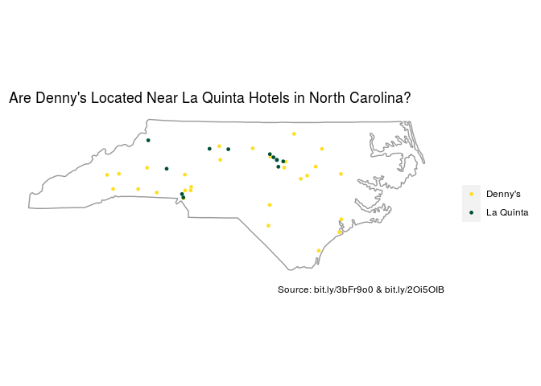
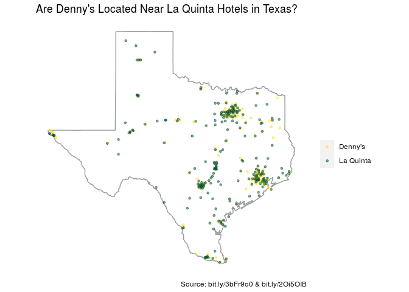
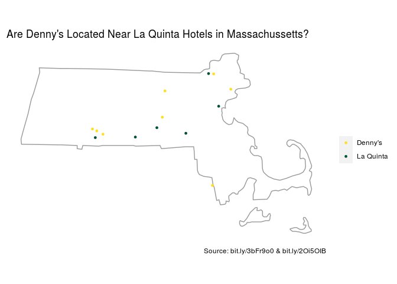

Lab 04 - La Quinta is Spanish for next to Denny’s, Pt. 1
================
John Adams
3/12/21

## Lab 4 Directions

<https://rstudio-education.github.io/datascience-box/course-materials/lab-instructions/lab-04/lab-04-viz-sp-data.html>

### Load packages and data

``` r
library(tidyverse) 
library(dsbox) 
library(maps)
```

``` r
states <- read_csv(url("https://raw.githubusercontent.com/rstudio-education/datascience-box/master/course-materials/starters/lab/lab-04-viz-sp-data/data/states.csv"))
```

### Exercise 1

``` r
glimpse(dennys)
```

    ## Rows: 1,643
    ## Columns: 6
    ## $ address   <chr> "2900 Denali", "3850 Debarr Road", "1929 Airport Way", "230 …
    ## $ city      <chr> "Anchorage", "Anchorage", "Fairbanks", "Auburn", "Birmingham…
    ## $ state     <chr> "AK", "AK", "AK", "AL", "AL", "AL", "AL", "AL", "AL", "AL", …
    ## $ zip       <chr> "99503", "99508", "99701", "36849", "35207", "35294", "35056…
    ## $ longitude <dbl> -149.8767, -149.8090, -147.7600, -85.4681, -86.8317, -86.803…
    ## $ latitude  <dbl> 61.1953, 61.2097, 64.8366, 32.6033, 33.5615, 33.5007, 34.206…

There are 1643 Denny’s restaurants and 6 variables.

### Exercise 2

``` r
glimpse(laquinta)
```

    ## Rows: 909
    ## Columns: 6
    ## $ address   <chr> "793 W. Bel Air Avenue", "3018 CatClaw Dr", "3501 West Lake …
    ## $ city      <chr> "\nAberdeen", "\nAbilene", "\nAbilene", "\nAcworth", "\nAda"…
    ## $ state     <chr> "MD", "TX", "TX", "GA", "OK", "TX", "AG", "TX", "NM", "NM", …
    ## $ zip       <chr> "21001", "79606", "79601", "30102", "74820", "75254", "20345…
    ## $ longitude <dbl> -76.18846, -99.77877, -99.72269, -84.65609, -96.63652, -96.8…
    ## $ latitude  <dbl> 39.52322, 32.41349, 32.49136, 34.08204, 34.78180, 32.95164, …

There are 909 La Quinta hotels and 6 variables.

### Exercise 3

There aren’t any Denny’s outside of the US, but La Quinta does have
hotels outside of the US.

### Exercise 4

Using the data you could: - visualize the location using long and lat -
count the state variable

### Exercise 5

``` r
dennys %>%
  filter(!(state %in% states$abbreviation))
```

    ## # A tibble: 0 x 6
    ## # … with 6 variables: address <chr>, city <chr>, state <chr>, zip <chr>,
    ## #   longitude <dbl>, latitude <dbl>

### Exercise 6

``` r
dn <- dennys %>%
        mutate(country = "United States")
```

### Exercise 8

``` r
laquinta %>%
  filter(!(state %in% states$abbreviation))
```

    ## # A tibble: 14 x 6
    ##    address                     city               state zip   longitude latitude
    ##    <chr>                       <chr>              <chr> <chr>     <dbl>    <dbl>
    ##  1 Carretera Panamericana Sur… "\nAguascalientes" AG    20345    -102.     21.8 
    ##  2 Av. Tulum Mza. 14 S.M. 4 L… "\nCancun"         QR    77500     -86.8    21.2 
    ##  3 Ejercito Nacional 8211      "Col\nPartido Igl… CH    32528    -106.     31.7 
    ##  4 Blvd. Aeropuerto 4001       "Parque Industria… NL    66600    -100.     25.8 
    ##  5 Carrera 38 # 26-13 Avenida… "\nMedellin Colom… ANT   0500…     -75.6     6.22
    ##  6 AV. PINO SUAREZ No. 1001    "Col. Centro\nMon… NL    64000    -100.     25.7 
    ##  7 Av. Fidel Velazquez #3000 … "\nMonterrey"      NL    64190    -100.     25.7 
    ##  8 63 King Street East         "\nOshawa"         ON    L1H1…     -78.9    43.9 
    ##  9 Calle Las Torres-1 Colonia… "\nPoza Rica"      VE    93210     -97.4    20.6 
    ## 10 Blvd. Audi N. 3 Ciudad Mod… "\nSan Jose Chiap… PU    75010     -97.8    19.2 
    ## 11 Ave. Zeta del Cochero No 4… "Col. ReservaTerr… PU    72810     -98.2    19.0 
    ## 12 Av. Benito Juarez 1230 B (… "\nSan Luis Potos… SL    78399    -101.     22.1 
    ## 13 Blvd. Fuerza Armadas        "contiguo Mall La… FM    11101     -87.2    14.1 
    ## 14 8640 Alexandra Rd           "\nRichmond"       BC    V6X1…    -123.     49.2

``` r
lq <- laquinta %>%
  mutate(country = case_when(
    state %in% state.abb     ~ "United States",
    state %in% c("ON", "BC") ~ "Canada",
    state == "ANT"           ~ "Colombia",
    state %in% c("AG", "QR", "CH", "NL", "VE", "PU", "SL" )  ~ "Mexico",
    state == "FM" ~ "Honduras"
  )) %>%
  filter(country == "United States")
```

``` r
dn %>%
  group_by(state) %>%
  count() %>%
  arrange(desc(n))
```

    ## # A tibble: 51 x 2
    ## # Groups:   state [51]
    ##    state     n
    ##    <chr> <int>
    ##  1 CA      403
    ##  2 TX      200
    ##  3 FL      140
    ##  4 AZ       83
    ##  5 IL       56
    ##  6 NY       56
    ##  7 WA       49
    ##  8 OH       44
    ##  9 MO       42
    ## 10 PA       40
    ## # … with 41 more rows

``` r
lq %>%
  group_by(state) %>%
  count() %>%
  arrange(desc(n))
```

    ## # A tibble: 48 x 2
    ## # Groups:   state [48]
    ##    state     n
    ##    <chr> <int>
    ##  1 TX      237
    ##  2 FL       74
    ##  3 CA       56
    ##  4 GA       41
    ##  5 TN       30
    ##  6 OK       29
    ##  7 LA       28
    ##  8 CO       27
    ##  9 NM       19
    ## 10 NY       19
    ## # … with 38 more rows

These numbers aren’t that surprising as California, Texas, and Florida
are all big states that attract a lot of tourists.

### Exercise 9

``` r
dn %>%
  count(state) %>%
  inner_join(states, by = c("state" = "abbreviation"))
```

    ## # A tibble: 51 x 4
    ##    state     n name                     area
    ##    <chr> <int> <chr>                   <dbl>
    ##  1 AK        3 Alaska               665384. 
    ##  2 AL        7 Alabama               52420. 
    ##  3 AR        9 Arkansas              53179. 
    ##  4 AZ       83 Arizona              113990. 
    ##  5 CA      403 California           163695. 
    ##  6 CO       29 Colorado             104094. 
    ##  7 CT       12 Connecticut            5543. 
    ##  8 DC        2 District of Columbia     68.3
    ##  9 DE        1 Delaware               2489. 
    ## 10 FL      140 Florida               65758. 
    ## # … with 41 more rows

### Exercise 10

``` r
dn %>%
  count(state) %>%
  inner_join(states, by = c("state" = "abbreviation")) %>%
  mutate(
    area_thousands = area/1000,
    locations_per_area_thousands = n/(area/1000)) %>%
  arrange(desc(locations_per_area_thousands))
```

    ## # A tibble: 51 x 6
    ##    state     n name                 area area_thousands locations_per_area_thou…
    ##    <chr> <int> <chr>               <dbl>          <dbl>                    <dbl>
    ##  1 DC        2 District of Col…     68.3         0.0683                   29.3  
    ##  2 RI        5 Rhode Island       1545.          1.54                      3.24 
    ##  3 CA      403 California       163695.        164.                        2.46 
    ##  4 CT       12 Connecticut        5543.          5.54                      2.16 
    ##  5 FL      140 Florida           65758.         65.8                       2.13 
    ##  6 MD       26 Maryland          12406.         12.4                       2.10 
    ##  7 NJ       10 New Jersey         8723.          8.72                      1.15 
    ##  8 NY       56 New York          54555.         54.6                       1.03 
    ##  9 IN       37 Indiana           36420.         36.4                       1.02 
    ## 10 OH       44 Ohio              44826.         44.8                       0.982
    ## # … with 41 more rows

``` r
lq %>%
  count(state) %>%
  inner_join(states, by = c("state" = "abbreviation")) %>%
  mutate(
    area_thousands = area/1000,
    locations_per_area_thousands = n/(area/1000)) %>%
  arrange(desc(locations_per_area_thousands))
```

    ## # A tibble: 48 x 6
    ##    state     n name             area area_thousands locations_per_area_thousands
    ##    <chr> <int> <chr>           <dbl>          <dbl>                        <dbl>
    ##  1 RI        2 Rhode Island    1545.           1.54                        1.29 
    ##  2 FL       74 Florida        65758.          65.8                         1.13 
    ##  3 CT        6 Connecticut     5543.           5.54                        1.08 
    ##  4 MD       13 Maryland       12406.          12.4                         1.05 
    ##  5 TX      237 Texas         268596.         269.                          0.882
    ##  6 TN       30 Tennessee      42144.          42.1                         0.712
    ##  7 GA       41 Georgia        59425.          59.4                         0.690
    ##  8 NJ        5 New Jersey      8723.           8.72                        0.573
    ##  9 MA        6 Massachusetts  10554.          10.6                         0.568
    ## 10 LA       28 Louisiana      52378.          52.4                         0.535
    ## # … with 38 more rows

``` r
dn <- dn %>%
  mutate(establishment = "Denny's")
lq <- lq %>%
  mutate(establishment = "La Quinta")

dn_lq <- bind_rows(dn, lq)
```

``` r
dn_lq %>%
  ggplot(aes(x = longitude, y = latitude, color = establishment)) +
  borders("state") +
  geom_point(alpha = 0.25, size = 0.5) +
  coord_quickmap() +
  labs(
    title = "Are Denny's Located Near La Quinta Hotels in the United States?",
    caption = "Source: bit.ly/3bFr9o0 & bit.ly/2Oi5OIB",
    x = NULL, 
    y = NULL,
    color = ""
  ) +
  scale_color_manual(values = c(
    "Denny's" = "#ffde24",
    "La Quinta" = "#005033"
  )) +
  theme(
    panel.grid = element_blank(),
    panel.background = element_rect(fill = NA),
    axis.text = element_blank(),
    legend.position = "right", 
    axis.ticks = element_blank()
  ) 
```

<!-- -->

### Trying to figure out how to map just one state

``` r
nc <- map_data('state', "north carolina")

mid_range <- function(x) mean(range(x))

seats <- do.call(rbind, lapply(split(nc, nc$subregion), function(d) {
  data.frame(lat = mid_range(d$lat), long = mid_range(d$long), subregion = unique(d$subregion))
}))


nc_dn_lq <- dn_lq  %>%
  filter(state == "NC")

nc <- nc %>%
  rename(longitude = long,
         latitude = lat
  )

nc_dn_lq_map <- full_join(nc_dn_lq, nc)
```

    ## Joining, by = c("longitude", "latitude")

``` r
nc_dn_lq_map_poly <- full_join(nc_dn_lq, nc) %>%
filter(!is.na(group))
```

    ## Joining, by = c("longitude", "latitude")

``` r
nc_dn_lq_map %>%  
  filter(is.na(group)) %>%
  ggplot(aes(x = longitude, y = latitude)) +
  geom_polygon(aes(group = group), data = nc_dn_lq_map_poly, fill = NA, colour = "grey60") +
  coord_quickmap() +
  geom_point(alpha = 1, size = 1, aes(color = establishment)) +
  labs(
    title = "Are Denny's Located Near La Quinta Hotels in the United States?",
    caption = "Source: bit.ly/3bFr9o0 & bit.ly/2Oi5OIB",
    x = NULL, 
    y = NULL,
    color = ""
  ) +
  scale_color_manual(values = c(
    "Denny's" = "#ffde24",
    "La Quinta" = "#005033"
  )) +
  theme(
    panel.grid = element_blank(),
    panel.background = element_rect(fill = NA),
    axis.text = element_blank(),
    legend.position = "right", 
    axis.ticks = element_blank()
  ) 
```

<!-- -->

### After figuring out how to map one state

North Carolina

``` r
  dn_lq %>%
    filter(state == "NC") %>%
  ggplot(aes(x = longitude, y = latitude)) +
  geom_polygon(aes(group = group), data = nc, fill = NA, colour = "grey60") +
  coord_quickmap() +
  geom_point(alpha = 1, size = 1, aes(color = establishment)) +
  labs(
    title = "Are Denny's Located Near La Quinta Hotels in North Carolina?",
    caption = "Source: bit.ly/3bFr9o0 & bit.ly/2Oi5OIB",
    x = NULL, 
    y = NULL,
    color = ""
  ) +
  scale_color_manual(values = c(
    "Denny's" = "#ffde24",
    "La Quinta" = "#005033"
  )) +
  theme(
    panel.grid = element_blank(),
    panel.background = element_rect(fill = NA),
    axis.text = element_blank(),
    legend.position = "right", 
    axis.ticks = element_blank()
  ) 
```

<!-- -->

``` r
tx <- map_data('state', "texas")
mid_range <- function(x) mean(range(x))
seats_tx <- do.call(rbind, lapply(split(tx, tx$subregion), function(d) {
  data.frame(lat = mid_range(d$lat), long = mid_range(d$long), subregion = unique(d$subregion))
})) 

tx <- tx %>%
    rename(longitude = long,
         latitude = lat
  )

dn_lq %>%
    filter(state == "TX") %>%
  ggplot(aes(x = longitude, y = latitude)) +
  geom_polygon(aes(group = group), data = tx, fill = NA, colour = "grey60") +
  coord_quickmap() +
  geom_point(alpha = 0.5, size = 1, aes(color = establishment)) +
  labs(
    title = "Are Denny's Located Near La Quinta Hotels in Texas?",
    caption = "Source: bit.ly/3bFr9o0 & bit.ly/2Oi5OIB",
    x = NULL, 
    y = NULL,
    color = ""
  ) +
  scale_color_manual(values = c(
    "Denny's" = "#ffde24",
    "La Quinta" = "#005033"
  )) +
  theme(
    panel.grid = element_blank(),
    panel.background = element_rect(fill = NA),
    axis.text = element_blank(),
    legend.position = "right", 
    axis.ticks = element_blank()
  ) 
```

<!-- -->

``` r
ma <- map_data('state', "massachusetts")
mid_range <- function(x) mean(range(x))
seats_ma <- do.call(rbind, lapply(split(ma, tx$subregion), function(d) {
  data.frame(lat = mid_range(d$lat), long = mid_range(d$long), subregion = unique(d$subregion))
})) 
```

    ## Warning in split.default(x = seq_len(nrow(x)), f = f, drop = drop, ...): data
    ## length is not a multiple of split variable

``` r
ma <- ma %>%
    rename(longitude = long,
         latitude = lat
  )

dn_lq %>%
    filter(state == "MA") %>%
  ggplot(aes(x = longitude, y = latitude)) +
  geom_polygon(aes(group = group), data = ma, fill = NA, colour = "grey60") +
  coord_quickmap() +
  geom_point(alpha = 1, size = 1, aes(color = establishment)) +
  labs(
    title = "Are Denny's Located Near La Quinta Hotels in Massachussetts?",
    caption = "Source: bit.ly/3bFr9o0 & bit.ly/2Oi5OIB",
    x = NULL, 
    y = NULL,
    color = ""
  ) +
  scale_color_manual(values = c(
    "Denny's" = "#ffde24",
    "La Quinta" = "#005033"
  )) +
  theme(
    panel.grid = element_blank(),
    panel.background = element_rect(fill = NA),
    axis.text = element_blank(),
    legend.position = "right", 
    axis.ticks = element_blank()
  ) 
```

<!-- -->
